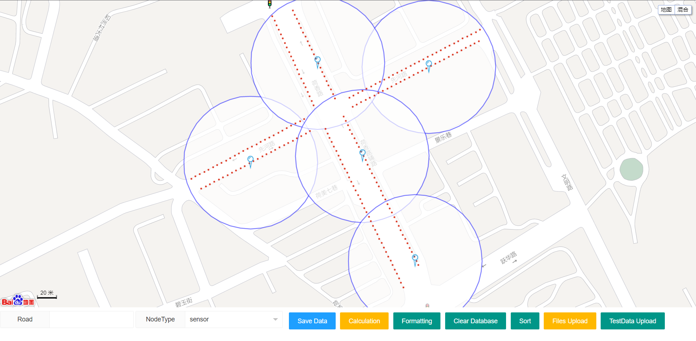
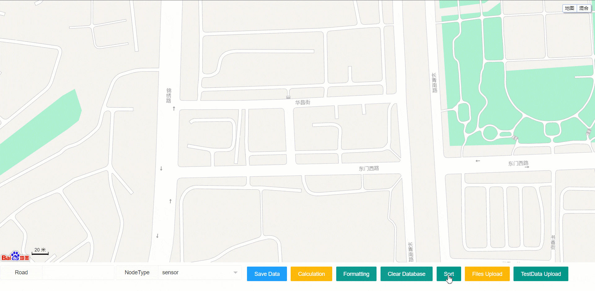

# Transportation Gateway Deployment System
<!-- Add banner here -->


<p align="center">
  <sub>
    Built by
    <a href="https://github.com/drggboy">drggboy</a>,
    <a href="https://github.com/grtm77">grtm77</a>
  </sub>
</p>

<p align="center">
  <a href="" target="_blank">
    
  </a>
  <a href="" target="_blank">
    
  </a>
  </br>
  <a href="https://github.com/drggboy/mytest_v2/releases" target="_blank">
    
  </a>
  
  <a href="https://github.com/drggboy/mytest_v2/commits/master" target="_blank">
    
  </a>

  <!-- <a href="https://github.com/drggboy/mytest_v2/issues" target="_blank">
    
  </a> -->

  <!-- <a href="https://github.com/drggboy/mytest_v2/pulls" target="_blank">
    
  </a> -->

  <a href="https://github.com/drggboy/mytest_v2/graphs/contributors" target="_blank">
    
  </a>


  <a href="https://github.com/drggboy/mytest_v2/blob/master/LICENSE" target="_blank">
    
  <a/>
</p>
<hr>

<!-- Remove this note if you plan to copy this README -->


# Table of Contents
- [Transportation Gateway Deployment System](#transportation-gateway-deployment-system)
- [Table of Contents](#table-of-contents)
- [Demo](#demo)
- [Usage](#usage)
- [Environment dependent](#environment-dependent)
- [Deployment steps](#deployment-steps)
- [Directory Structure Description](#directory-structure-description)
  - [xxx](#xxx)
- [Contributors](#contributors)
- [License](#license)

# Demo

<!-- Add a demo for your project -->

I believe that you should bring value to the reader as soon as possible. You should be able to get the user up and running with your project with minimal friction.



If you have a quickstart guide, this is where it should be.

Alternatively, you can add a demo to show what your project can do.

# Usage
Next, you have to explain how to use your project. You can create subsections under here to explain more clearly.


# Environment dependent
* operating environment
  * JRE v1.8
  * MATLAB Runtime R2016b (9.1)


# Deployment steps

Clone this repository and navigate inside the project root folder.

If you want to modify the style of the front end, please enter the project root directory, and then execute the following code.
```sh
cd ./vue
npm install
```
After installing the dependencies, you can modify the front-end related code in /vue/src/App.vue, and then execute the following command to view the front-end interface.
```sh
npm run dev
```
After the front-end interface is modified, you can compile the static file.
```sh
npm run build
```
Then a static file will be generated in the dist directory, and the spring boot project can be started after moving it to the /mytest_v2/src/main/resources/static directory, which can be moved directly through the script
```python
python .\move_build_output.py
```

# Directory Structure Description
```sh
|-- README.md     // help
|-- src           // Backend processing related
|-- vue           // Front-end vue code
|-- images
|-- mvnw
|-- mvnw.cmd
|-- pom.xml
|-- LICENSE
```

## xxx

To install the developer version follow the steps below. To just use the extension download from [**chrome.google.com/webstore/nsfw-filter**](https://chrome.google.com/webstore/detail/nsfw-filter/kmgagnlkckiamnenbpigfaljmanlbbhh).

To run development version in clean environment use command:

```sh
npm run dev:chrome
```

1. 添加系统环境变量
    export $PORTAL_VERSION="production" // production, test, dev


2. npm install  //安装node运行环境

3. gulp build   //前端编译

4. 启动两个配置(已forever为例)
    eg: forever start app-service.js
        forever start logger-service.js

# Contributors

Thanks goes to these wonderful people ([emoji key](https://allcontributors.org/docs/en/emoji-key)):

<!-- ALL-CONTRIBUTORS-LIST:START - Do not remove or modify this section -->
<!-- prettier-ignore-start -->
<!-- markdownlint-disable -->
<table>
  <tbody>
    <tr>
      <td align="center" valign="top" width="14.28%"><a href="https://github.com/drggboy"><br /><sub><b>drggboy</b></sub></a><br /><a href="https://github.com/grtm77/mytest_v2/commits?author=drggboy" title="Code">💻</a> <a href="https://github.com/grtm77/mytest_v2/commits?author=drggboy" title="Documentation">📖</a></td>
      <td align="center" valign="top" width="14.28%"><a href="https://github.com/grtm77"><br /><sub><b>grtm77</b></sub></a><br /><a href="https://github.com/grtm77/mytest_v2/commits?author=grtm77" title="Code">💻</a> <a href="https://github.com/grtm77/mytest_v2/commits?author=grtm77" title="Documentation">📖</a></td>
    </tr>
  </tbody>
  <tfoot>
    <tr>
      <td align="center" size="13px" colspan="7">
        
          <a href="https://all-contributors.js.org/docs/en/bot/usage">Add your contributions</a>
        </img>
      </td>
    </tr>
  </tfoot>
</table>

<!-- markdownlint-restore -->
<!-- prettier-ignore-end -->

<!-- ALL-CONTRIBUTORS-LIST:END -->

This project follows the [all-contributors](https://github.com/all-contributors/all-contributors) specification. Contributions of any kind welcome!


# License
> **Note**: For longer README files, I usually add a "Back to top" buttton as shown above. It makes it easy to navigate.

[(Back to top)](#目录)

[MIT](./LICENSE) license.
